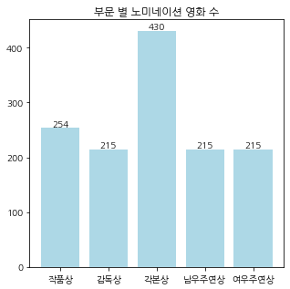
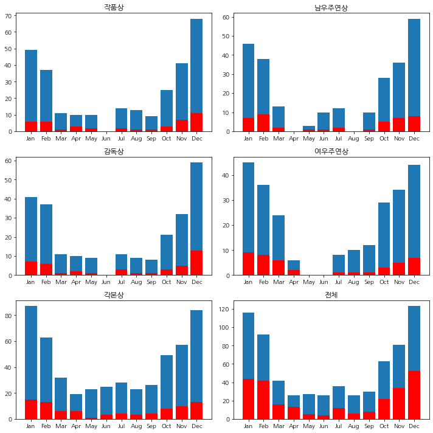
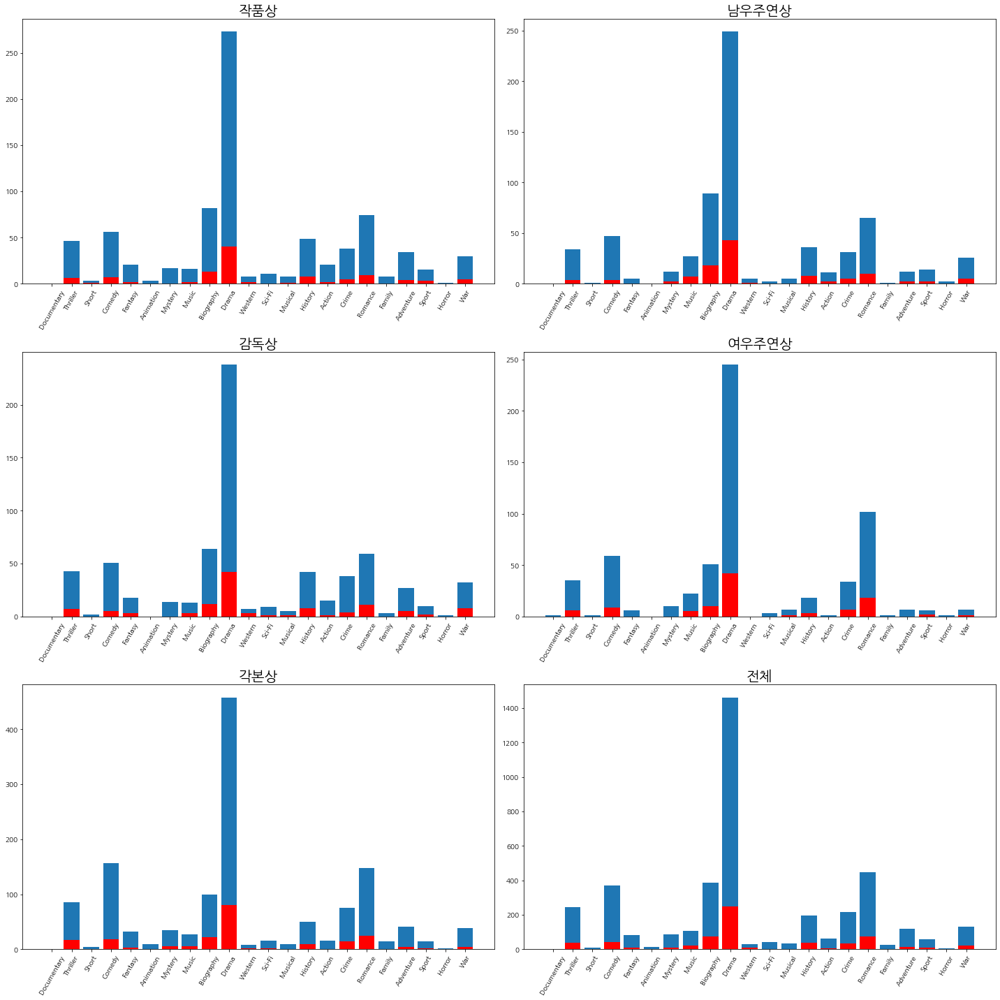
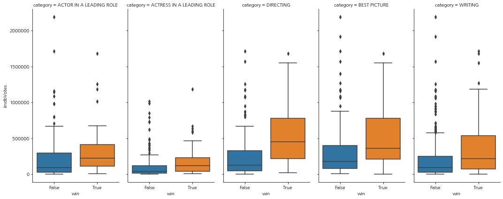
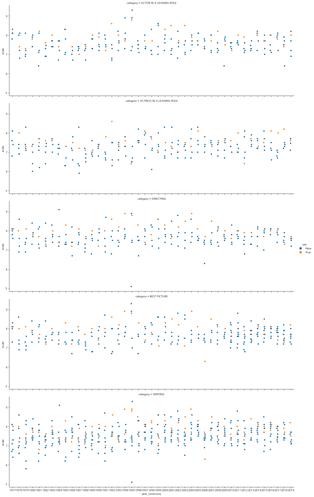
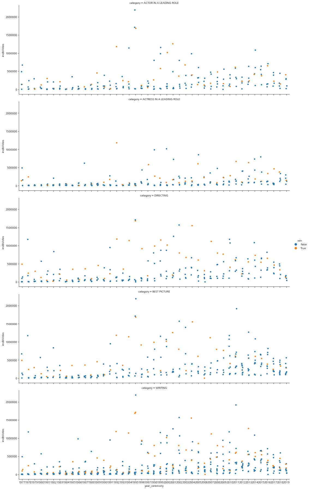
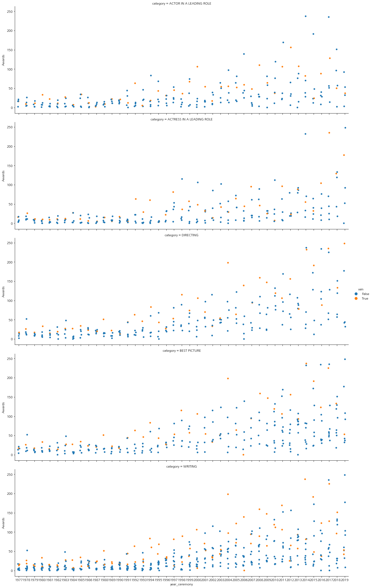
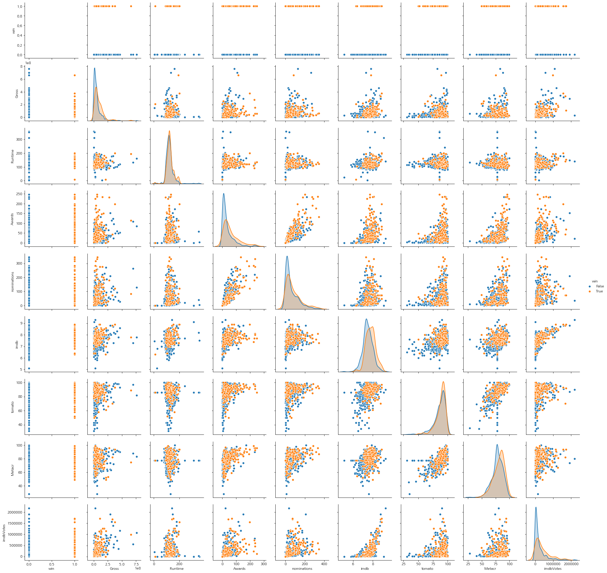

# predicting_Oscar_winner
predict Oscar winner with ML and DNN

* Oscar 수상작을 예측하는 모델을 다양한 ML과 DNN으로 만들었습니다. 
* 역대 노미네이트 작품 데이터는 Kaggle에서 구했습니다.
* 데이터 수집에서 imdb 데이터 스크래핑은 같이 프로젝트를 진행한 친구가 맡아 코드가 없습니다. 
* EDA에서는 수상작들의 데이터 분포를 다양한 방법으로 시각화했습니다. 

## Data visualiztion
### 부문별 노미네이션 영화 수 
  
* 각본상은 이름을 'WRITING'으로 통일하는 과정에서 데이터의 수가 늘었다.  
* 전체적으로 데이터 수가 적다. 
* feature를 수집 할 수 있는 데이터를 선별하는 과정에서 데이터의 수가 줄었다. 
* 한 해의 수상작은 1개이다. 노미네이션은 5~8작품. 불균형 데이터이다. 
### 월별 수상작과 노미네이션 영화 수 
  
노미네이션된 작품들과 수상된 작품들의 월별 분포를 그린 barplot이다.  
전 부문 겨울(10월-2월)에 개봉된 작품들이 많고, 그에 비례하여 수상하는 것으로 보인다.  
### 장르별 수상작과 노미네이션 영화 수 
  
* 거의 모든 영화가 Drama 장르를 포함하고 있다.
* 작품상과 감독상에서 Western 장르를 보면 노미네이션 된 작품 중 수상의 비율이 절반에 가까운 것을 볼 수 있다.
* Western장르가 노미네이트 되면 수상 확률이 높다.
* Mystery 장르는 작품상과, 감독상을 수상한 횟수가 없다. 하지만 각본상 수상은 노미네이트 된 횟수에 비해 많다.
* Documentery 장르는 전부문에서 노미네이트 된적이 없다.
* 몇몇 장르(Animation, Short, Horror, Family) 노미네이트 되어도 수상한 이력이 없다.
* 감독상에서 War장르는 다른 부문에서 비해 수상 횟수가 많다. 감독상에 War장르의 영화가 노미네이트 되면 수상 확률이 높다.
* 여우주연상에서 여성이 거의 출연하지 않는 장르(Western, War)는 노미네이션 횟수, 수상 횟수가 적다.
* 여우주연상은 Comedy,Romance 장르에서 많이 노미네이션되고, 수상된다.
* 전 부문에서 History장르는 노미네이션 횟수 대비 수상 횟수가 많다.
### 부문별 feature에 따른 데이터 분포 (boxplot)
  
* 부문별 feature에 따른 데이터의 분포를 boxplot으로 확인한 결과 수상한 작품들의 박스가 수상하지 않을 것 보다 높이 위치한다는 것을 볼 수 있다. 대체적으로 평가지표가 높으면 수상 할 확률이 높다는 것을 의미한다.
* Heatmap에서 확인했던 상관도가 높은 imdb, imdbVotes, Awards에서 boxplot을 볼 때, 수상한 경우 IQR 범위가 넓고 박스가 높이 위치한 것을 볼 수 있다.
* 상관도가 낮았던 Rotten tomato에서 가져온 데이터인 tomato meter, rotten tomato meter의 값은 수상 여부에 따른 박스의 크기나 높이 차이가 상대적으로 없다.
* imdb는 아웃라이어가 위에, tomato meter는 밑에 생기는 것을 보아, imdb 사이트는 대중들이 대체적으로 좋은 쪽으로 평가하고, rotten tomato 사이트는 극적으로 안좋게 평가하는 경향이 있다는 것을 알 수 있다.
* 수상하지 못한 데이터들의 아웃라이어가 많은데, 이는 데이터 불균형으로 수상하지 않은 작품의 수가 수상한 갯수 보다 많아서 일 수 도 있다. 또한 아웃라이어들이 위쪽으로 있는 경우, 평점이 좋거나 흥행이 되고, 대중의 관심이 많다고 해도 꼭 수상하는 것이 아니라는 것을 알려준다.  
 ### 시상식 년도별 부문별 imdb 데이터 분포
  
* 상관도가 높았던 imdb, imdbVotes, Awards만 살펴보기로 하자.
* imdb.com 은 1990년에 생긴 영화 전문 사이트이다.
* 1990년도 이전의 기록은 시상식 이후에 작성된 것이므로, 시상 여부가 점수에 영향을 미처 높은 점수를 받았을 수 있다.
* 그 해에 imdb 점수가 높은 작품이 꼭 상을 타는 것은 아니다.
### 시상식 년도별, 부문별 imdbVotes 데이터 분포
  
* 1990년 이후로 투표가 눈에 띄게 많은 작품이 생겼다. 사이트가 생긴 후 사람들이 작품 투표에 참여를 많이 했다.
* imdbVotes 점수가 높은 작품이 수상을 하나 꼭 그렇다고 말할 수 없다.  
### 시상식 년도별, 부문별 Awards 데이터 분포
  
* Awards의 수는 하나의 영화가 수상한 상의 갯수이다. 어떤 항목으로 수상한지 모른다.
* 90년대 이후 영화제에서 수상한 상의 갯수가 늘어나는 걸로 보아, 현대에 영화제가 늘어났고, 수상 부분이 늘어났을 것으로 추정된다.
* 수상 이력이 많다고 해서 수상을 하는 것은 아니다.
### pairplot을 이용하여 feature들간의 상관 관계 
  
* 5개 부문 전체로 feature간의 상관관계를 보기위한 scatter를 수상 여부에 따라 색을 변경하여 pairplot이다.
* 특별하게 수상 여부를 결정하는 feature는 없는 것으로 보인다.
* imdb-imdbVotes 는 양의 상관관계가 있다.
* nominations - Awards 는 양의 상관관계가 있다.
* 그 외에 feature들은 상관관계를 보이고 있지 않다.

## Modeling

## Shortcuts
[데이터 수집 및 가공 바로가기](https://github.com/kse0202/predicting_Oscar_winner/blob/master/oscar_data.ipynb)  
[EDA 바로가기](https://github.com/kse0202/predicting_Oscar_winner/blob/master/oscar_EDA.ipynb)  

[작품상 모델링 바로가기](https://github.com/kse0202/predicting_Oscar_winner/blob/master/oscar_model_best.ipynb) 
[감독상 모델링 바로가기](https://github.com/kse0202/predicting_Oscar_winner/blob/master/oscar_model_direct.ipynb) 
[각본상 모델링 바로가기](https://github.com/kse0202/predicting_Oscar_winner/blob/master/oscar_model_write.ipynb) 
[남우주연상 모델링 바로가기](https://github.com/kse0202/predicting_Oscar_winner/blob/master/oscar_model_actor.ipynb) 
[여우주연상 모델링 바로가기](https://github.com/kse0202/predicting_Oscar_winner/blob/master/oscar_model_actress.ipynb) 

## Reference 
[kaggle 데이터, The Academy Awards, 1927 - 2020](https://www.kaggle.com/unanimad/the-oscar-award)
